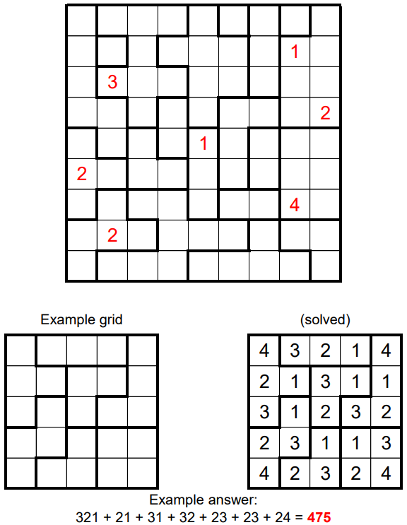

# 2019 September: Block Party 3

# Question:
<!-- https://www.janestreet.com/puzzles/block-party-3/ -->
https://www.janestreet.com/puzzles/block-party-3-index/

Fill each region with the digits 1 though N, where N is the number of cells in the given region. For every cell in the grid, if K denotes the number in that cell, then the nearest value of K (looking only horizontally or vertically) must be located exactly K cells away. (As in the example, below.) Some of the cells have already been filled in.

Once the grid is completed, take the largest “horizontally concatenated number” from each region and compute the sum of these values. Enter this sum as your answer. Good luck!

<!--  --> 
<!--  -->


# Solution:
The same solution is implemented in both Python3.6 and C++11. It involves finding and storing implications via bit manipulations.

To solve the problem it is conveninent to keep track of known/assumed values and excluded values for each square. The puzzle can then be solved with a sequence of implications (No trial and error decisions were needed). There are three implication rules X, R, and Z for each square: X is an implication caused by the exclusion of all but one possible value, R is an implication due to the exclusion of all but one value in the square's region, Z is an implication due to only one possible min distance satisfaction. Possible/excluded values for each square can be encoded as a single bit in a byte. 

[**Python solution**](./js_2019_09.py): Requires numpy

[**C++ solution**](./js_2019_09.cpp): No special requirements 

Both programs output the following solution:
```
------------------------------------
| 4 | 7   8   1 | 1 | 1 | 3 | 1 | 7 
     ---     ---     ---     ---    
| 1 | 1 | 2 | 7   2   6 | 1 | 1   3 
     ---     ---                    
| 5 | 3   6   4 | 3   5 | 2 | 4   6 
     ---     ---     --- ---        
| 3   2 | 5 | 2 | 4 | 2   3 | 5   2 
 ---     ---     ---     --- --- ---
| 4 | 6 | 3 | 1 | 1 | 4 | 2 | 6   3 
     ---     ---                    
| 2   1 | 2   1 | 3 | 1 | 1 | 1   2 
     --- --- ---     --- ---        
| 3 | 1 | 1   5 | 2 | 1   2 | 4   5 
 ---     ---     --- --- --- --- ---
| 5   2   3 | 2   4   6 | 1 | 1   3 
     --- ---     --- ---     ---    
| 4 | 3   8   7 | 3   4   2   5 | 2 
------------------------------------
Answer: 6092
```

The solution follows these implications:
```
X implied 1  at ( 0 , 5 }
X implied 1  at ( 0 , 7 }
X implied 1  at ( 1 , 1 }
Z implied 2  at ( 7 , 3 }
X excluded 3  at ( 0 , 0 }
X excluded 5  at ( 0 , 0 }
X excluded 6  at ( 0 , 0 }
X excluded 2  at ( 0 , 1 }
X excluded 5  at ( 0 , 1 }
X excluded 6  at ( 0 , 1 }
X excluded 1  at ( 0 , 2 }
X excluded 4  at ( 0 , 2 }
X excluded 5  at ( 0 , 2 }
X excluded 7  at ( 0 , 2 }
X excluded 2  at ( 0 , 3 }
X excluded 4  at ( 0 , 3 }
X excluded 7  at ( 0 , 3 }
X excluded 3  at ( 0 , 4 }
X excluded 5  at ( 0 , 4 }
X excluded 6  at ( 0 , 4 }
X excluded 3  at ( 0 , 8 }
X excluded 6  at ( 1 , 0 }
X excluded 4  at ( 1 , 2 }
X excluded 8  at ( 1 , 2 }
X excluded 4  at ( 1 , 3 }
X excluded 6  at ( 1 , 3 }
X excluded 1  at ( 1 , 4 }
X excluded 3  at ( 1 , 4 }
X excluded 5  at ( 1 , 4 }
X excluded 7  at ( 1 , 4 }
X excluded 7  at ( 1 , 5 }
X excluded 7  at ( 1 , 8 }
X excluded 1  at ( 2 , 0 }
X excluded 6  at ( 2 , 0 }
X excluded 1  at ( 2 , 2 }
X excluded 7  at ( 2 , 2 }
X excluded 8  at ( 2 , 2 }
X excluded 7  at ( 2 , 3 }
X excluded 8  at ( 2 , 3 }
X excluded 6  at ( 2 , 4 }
X excluded 7  at ( 2 , 4 }
X excluded 4  at ( 2 , 5 }
X excluded 6  at ( 2 , 5 }
X excluded 7  at ( 2 , 5 }
X excluded 3  at ( 2 , 6 }
X excluded 6  at ( 2 , 7 }
X excluded 7  at ( 2 , 7 }
X excluded 7  at ( 2 , 8 }
X excluded 6  at ( 3 , 0 }
X excluded 6  at ( 3 , 2 }
X excluded 7  at ( 3 , 2 }
X excluded 8  at ( 3 , 2 }
X excluded 6  at ( 3 , 4 }
X excluded 7  at ( 3 , 4 }
X excluded 3  at ( 3 , 5 }
X excluded 7  at ( 3 , 7 }
X excluded 5  at ( 4 , 1 }
X excluded 5  at ( 4 , 7 }
X excluded 1  at ( 4 , 8 }
X excluded 5  at ( 4 , 8 }
X excluded 6  at ( 4 , 8 }
X excluded 5  at ( 5 , 7 }
X excluded 6  at ( 5 , 7 }
X excluded 1  at ( 5 , 8 }
X excluded 6  at ( 5 , 8 }
X excluded 4  at ( 6 , 1 }
X excluded 5  at ( 6 , 1 }
X excluded 3  at ( 6 , 2 }
X excluded 7  at ( 6 , 2 }
X excluded 8  at ( 6 , 2 }
X excluded 7  at ( 6 , 3 }
X excluded 8  at ( 6 , 3 }
X excluded 3  at ( 6 , 8 }
X excluded 8  at ( 7 , 4 }
X excluded 7  at ( 7 , 5 }
X excluded 8  at ( 7 , 5 }
X excluded 3  at ( 7 , 6 }
X excluded 5  at ( 7 , 6 }
X excluded 6  at ( 8 , 1 }
X excluded 7  at ( 8 , 1 }
X excluded 4  at ( 8 , 3 }
X excluded 5  at ( 8 , 3 }
X excluded 1  at ( 8 , 6 }
X excluded 2  at ( 8 , 7 }
X implied 3  at ( 4 , 8 }
R implied 7  at ( 0 , 8 }
Z implied 7  at ( 0 , 1 }
X excluded 1  at ( 0 , 0 }
X excluded 5  at ( 0 , 3 }
X excluded 5  at ( 5 , 8 }
X excluded 7  at ( 7 , 4 }
X excluded 8  at ( 8 , 1 }
X excluded 7  at ( 8 , 2 }
X excluded 3  at ( 8 , 7 }
X implied 2  at ( 5 , 8 }
R implied 7  at ( 1 , 3 }
R implied 5  at ( 6 , 8 }
R implied 7  at ( 8 , 3 }
X excluded 8  at ( 0 , 3 }
X excluded 3  at ( 1 , 6 }
X excluded 6  at ( 2 , 3 }
X excluded 3  at ( 5 , 3 }
X excluded 2  at ( 7 , 7 }
X excluded 1  at ( 7 , 8 }
X excluded 3  at ( 8 , 0 }
X excluded 3  at ( 8 , 6 }
X implied 1  at ( 5 , 7 }
R implied 8  at ( 0 , 2 }
R implied 3  at ( 0 , 6 }
R implied 6  at ( 4 , 7 }
R implied 8  at ( 8 , 2 }
Z implied 3  at ( 3 , 6 }
Z implied 6  at ( 4 , 1 }
Z implied 1  at ( 5 , 6 }
X excluded 2  at ( 0 , 0 }
X excluded 2  at ( 0 , 4 }
X excluded 3  at ( 2 , 5 }
X excluded 6  at ( 3 , 7 }
X excluded 3  at ( 5 , 2 }
X excluded 6  at ( 6 , 2 }
X excluded 4  at ( 8 , 6 }
X implied 4  at ( 0 , 0 }
X implied 5  at ( 3 , 7 }
X implied 2  at ( 4 , 6 }
R implied 3  at ( 4 , 2 }
Z implied 3  at ( 7 , 2 }
Z implied 5  at ( 6 , 3 }
X excluded 6  at ( 0 , 3 }
X excluded 5  at ( 1 , 2 }
X excluded 5  at ( 2 , 2 }
X excluded 5  at ( 2 , 4 }
X excluded 5  at ( 3 , 1 }
X excluded 4  at ( 3 , 2 }
X excluded 4  at ( 6 , 0 }
X excluded 3  at ( 6 , 4 }
X excluded 4  at ( 7 , 6 }
X excluded 3  at ( 7 , 7 }
X excluded 5  at ( 8 , 4 }
X excluded 5  at ( 8 , 6 }
X implied 1  at ( 0 , 3 }
X implied 1  at ( 6 , 1 }
X implied 2  at ( 6 , 4 }
X implied 1  at ( 6 , 5 }
X implied 2  at ( 6 , 6 }
X implied 1  at ( 7 , 6 }
X implied 1  at ( 7 , 7 }
X implied 2  at ( 8 , 6 }
X implied 5  at ( 8 , 7 }
R implied 5  at ( 3 , 2 }
R implied 3  at ( 5 , 4 }
Z implied 1  at ( 0 , 4 }
Z implied 1  at ( 1 , 0 }
Z implied 4  at ( 2 , 7 }
X excluded 4  at ( 1 , 4 }
X excluded 5  at ( 1 , 5 }
X excluded 1  at ( 2 , 6 }
X excluded 1  at ( 3 , 3 }
X excluded 2  at ( 3 , 4 }
X excluded 1  at ( 3 , 5 }
X excluded 1  at ( 4 , 0 }
X excluded 3  at ( 4 , 0 }
X excluded 1  at ( 7 , 4 }
X excluded 1  at ( 8 , 1 }
X implied 2  at ( 2 , 6 }
X implied 6  at ( 2 , 8 }
X implied 2  at ( 3 , 1 }
X implied 2  at ( 3 , 3 }
X implied 4  at ( 3 , 4 }
X implied 2  at ( 3 , 5 }
X implied 4  at ( 4 , 0 }
X implied 1  at ( 4 , 3 }
X implied 5  at ( 7 , 0 }
X implied 4  at ( 8 , 0 }
X implied 3  at ( 8 , 1 }
R implied 1  at ( 1 , 6 }
R implied 3  at ( 1 , 8 }
R implied 5  at ( 2 , 0 }
R implied 5  at ( 2 , 5 }
R implied 3  at ( 3 , 0 }
Z implied 6  at ( 2 , 2 }
Z implied 3  at ( 6 , 0 }
Z implied 4  at ( 7 , 4 }
Z implied 2  at ( 5 , 2 }
Z implied 3  at ( 8 , 4 }
X excluded 6  at ( 1 , 4 }
X excluded 4  at ( 5 , 5 }
X excluded 3  at ( 8 , 8 }
X implied 2  at ( 1 , 2 }
X implied 2  at ( 1 , 4 }
X implied 4  at ( 2 , 3 }
X implied 3  at ( 2 , 4 }
X implied 1  at ( 5 , 1 }
X implied 1  at ( 5 , 3 }
X implied 1  at ( 5 , 5 }
X implied 1  at ( 6 , 2 }
X implied 6  at ( 7 , 5 }
X implied 4  at ( 8 , 5 }
X implied 2  at ( 8 , 8 }
R implied 6  at ( 1 , 5 }
R implied 4  at ( 4 , 5 }
R implied 3  at ( 7 , 8 }
```
