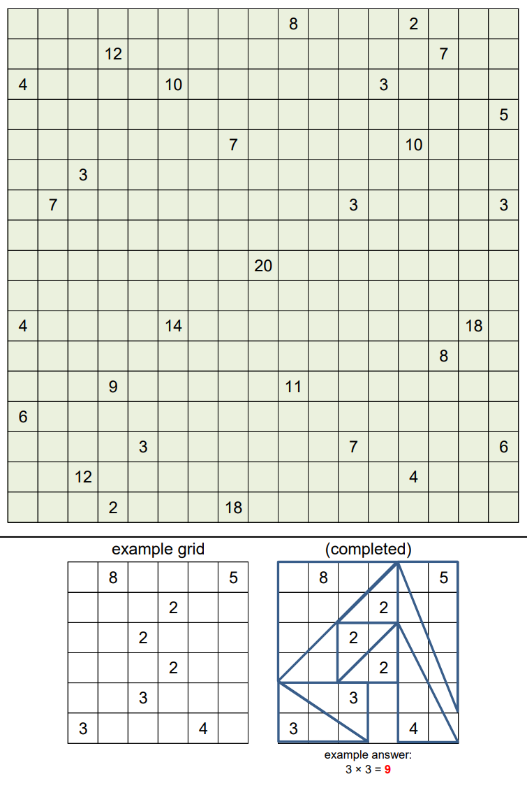

# 2019 September: Block Party 3

# Question:
https://www.janestreet.com/puzzles/tri-tri-again-again-index/

Place a collection of right triangles into the grid below. The triangles must have integer-length legs, and the legs must be along grid lines.

Each triangle must contain exactly one number. That number represents the **area** of the triangle containing it. (Every number must eventually be contained in exactly one triangle.) The entire square (1-by-1 cell) containing the number must be inside the triangle.

Triangles’ interiors may not overlap. (But triangles’ boundaries may intersect, as seen in the example.)

As your answer to this month’s puzzle, please send in the product of the **odd horizontal leg** lengths.

<!--  -->


# Solution:
The same solution is implemented in both Python3.6 and C++11. 

The solution involves creating template pieces of each feasible triangle possibility and placing them in configurations where their accompanying squares are covered. Overlaps are tested by creating a dense grid and ascertaining that each point in the dense grid is occupied by at most one triangle template. If a square cannot be covered, the algorithm backtracks and tries different configurations. The algorithm prioritizes placing largest pieces first.

[**Python solution**](./js_2019_10.py): Requires numpy

[**C++ solution**](./js_2019_10.cpp): No special requirements 

Both programs output the following solution:
```
(0,9)   (0,12)  (0,4)   (2,12)  8
(0,13)  (0,14)  (0,12)  (2,14)  2
(1,3)   (0,4)   (6,4)   (0,0)   4
(1,14)  (0,14)  (7,14)  (0,16)  2
(2,0)   (4,0)   (0,0)   (4,2)   2
(2,5)   (1,4)   (6,4)   (1,8)   4
(2,12)  (3,12)  (0,12)  (3,14)  2
(3,16)  (5,17)  (0,17)  (5,15)  2
(4,7)   (4,8)   (11,8)  (4,6)   2
(4,13)  (3,14)  (3,9)   (7,14)  5
(5,2)   (6,2)   (3,2)   (6,4)   2
(6,1)   (4,2)   (11,2)  (4,0)   2
(6,11)  (7,11)  (7,14)  (5,11)  3
(6,16)  (7,17)  (7,14)  (5,17)  3
(8,8)   (11,8)  (1,8)   (11,12) 4
(10,0)  (11,0)  (7,0)   (11,2)  2
(10,5)  (6,6)   (13,6)  (6,2)   4
(10,15) (7,17)  (7,11)  (13,17) 6
(11,14) (12,12) (12,16) (8,12)  4
(12,3)  (14,3)  (8,3)   (14,6)  3
(12,9)  (13,6)  (13,17) (11,6)  11
(13,0)  (11,0)  (17,0)  (11,2)  2
(14,4)  (14,5)  (17,5)  (14,3)  2
(14,11) (14,13) (14,6)  (16,13) 7
(14,16) (13,17) (16,17) (13,13) 4
(15,2)  (17,3)  (17,0)  (9,3)   3
(15,13) (16,13) (16,17) (14,13) 4
(16,3)  (17,3)  (17,5)  (15,3)  2
(16,7)  (17,5)  (17,17) (14,5)  12
Answer: 31185
 FINISHED !!!!!  NO MORE SOLUTIONS  !!!!!!!!
```

